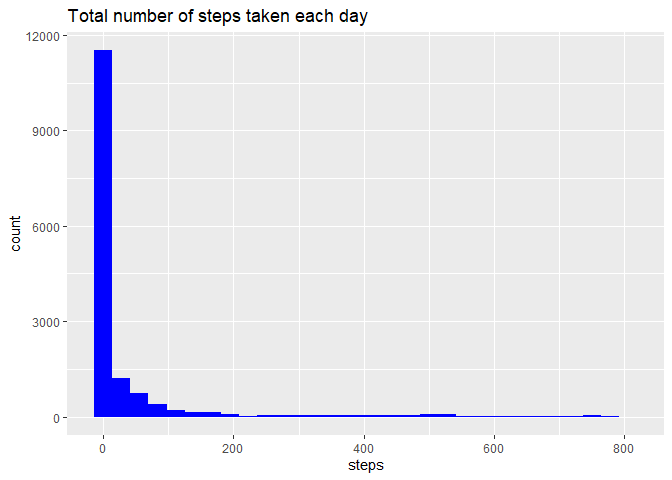

## Loading and preprocessing the data

### Load Packages


```r
library(dplyr)
```

```
## 
## Attaching package: 'dplyr'
```

```
## The following objects are masked from 'package:stats':
## 
##     filter, lag
```

```
## The following objects are masked from 'package:base':
## 
##     intersect, setdiff, setequal, union
```

```r
library(ggplot2)
```

### Load data


```r
# Reading in CSV data using readr package and read_csv function

path <- file.path("activity", "activity.csv")

activity <- readr::read_csv(file = path)
```

```
## Parsed with column specification:
## cols(
##   steps = col_double(),
##   date = col_date(format = ""),
##   interval = col_double()
## )
```

## What is mean total number of steps taken per day?

* Histogram showing total number of steps taken each day


```r
activity %>% 
ggplot(mapping = aes(x = steps)) +
  geom_histogram(fill = "blue")+
  ggtitle("Total number of steps taken each day")
```

```
## `stat_bin()` using `bins = 30`. Pick better value with `binwidth`.
```

```
## Warning: Removed 2304 rows containing non-finite values (stat_bin).
```

<!-- -->


## What is the average daily activity pattern?


## Imputing missing values


## Are there differences in activity patterns between weekdays and weekends?
