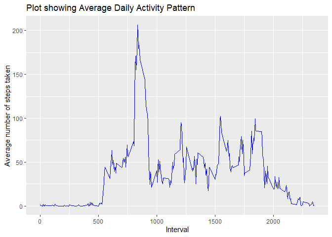

## Loading and preprocessing the data

### Load Packages


```r
library(dplyr)
```

```
## 
## Attaching package: 'dplyr'
```

```
## The following objects are masked from 'package:stats':
## 
##     filter, lag
```

```
## The following objects are masked from 'package:base':
## 
##     intersect, setdiff, setequal, union
```

```r
library(ggplot2)
```

### Load data


```r
# Reading in CSV data using readr package and read_csv function

path <- file.path("activity", "activity.csv")

activity <- readr::read_csv(file = path)
```

```
## Parsed with column specification:
## cols(
##   steps = col_double(),
##   date = col_date(format = ""),
##   interval = col_double()
## )
```

<p>&nbsp;</p>
#### Examining file 


```r
str(activity)
```

```
## tibble [17,568 x 3] (S3: spec_tbl_df/tbl_df/tbl/data.frame)
##  $ steps   : num [1:17568] NA NA NA NA NA NA NA NA NA NA ...
##  $ date    : Date[1:17568], format: "2012-10-01" "2012-10-01" ...
##  $ interval: num [1:17568] 0 5 10 15 20 25 30 35 40 45 ...
##  - attr(*, "spec")=
##   .. cols(
##   ..   steps = col_double(),
##   ..   date = col_date(format = ""),
##   ..   interval = col_double()
##   .. )
```

<p>&nbsp;</p>
#### Creating new file grouped by days across the two months and removing NA for this part of assignment.


```r
Totalactivity <- activity %>% 
group_by(date) %>% 
  filter(!is.na(steps)) %>% 
  summarise(totalsteps=sum(steps))
```

```
## `summarise()` ungrouping output (override with `.groups` argument)
```

## What is mean total number of steps taken per day?

<p>&nbsp;</p>
* Histogram showing total number of steps taken each day


```r
Totalactivity %>% 
ggplot(mapping = aes(x = totalsteps)) +
  geom_histogram(fill = "blue")+
  labs(x ="Total numbers of steps in a day", y="Count")+
  ggtitle("History showing total number of steps taken each day")
```

```
## `stat_bin()` using `bins = 30`. Pick better value with `binwidth`.
```

<!-- -->


<p>&nbsp;</p>
* Mean and median total number of steps taken per day across the two month period is calculated below.

```r
Totalactivity %>% 
  summarise(meansteps = mean(totalsteps), mediansteps = median(totalsteps))
```

```
## # A tibble: 1 x 2
##   meansteps mediansteps
##       <dbl>       <dbl>
## 1    10766.       10765
```

The mean total number of steps per day was 10766 and the median total number of steps per day was 10765.

## What is the average daily activity pattern?

<p>&nbsp;</p>
* Time series plot of the 5-minute interval and the average number of steps taken.

```r
activity %>% 
  group_by(interval) %>% 
summarise(avgsteps = mean(steps, na.rm = TRUE)) %>% 
  ggplot(mapping = aes(x=interval, y=avgsteps))+
  geom_line(color="blue", size=0.7)+
  labs(x ="Interval", y="Average number of steps taken")+
  ggtitle("Plot showing Average Daily Activity Pattern")
```

```
## `summarise()` ungrouping output (override with `.groups` argument)
```

<!-- -->

<p>&nbsp;</p>
* The 5-minute interval, on average across all the days in the dataset, containing the maximum number of steps.


```r
activity %>% 
  group_by(interval) %>% 
summarise(avgsteps = mean(steps, na.rm = TRUE)) %>% 
            arrange(desc(avgsteps))
```

```
## `summarise()` ungrouping output (override with `.groups` argument)
```

```
## # A tibble: 288 x 2
##    interval avgsteps
##       <dbl>    <dbl>
##  1      835     206.
##  2      840     196.
##  3      850     183.
##  4      845     180.
##  5      830     177.
##  6      820     171.
##  7      855     167.
##  8      815     158.
##  9      825     155.
## 10      900     143.
## # ... with 278 more rows
```
From the above, the 5-minute interval on average across all the days in the dataset, containing the maximum number of steps is the 835 interval.

## Imputing missing values


## Are there differences in activity patterns between weekdays and weekends?
